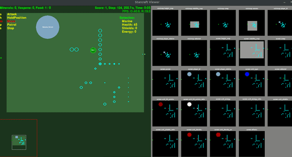
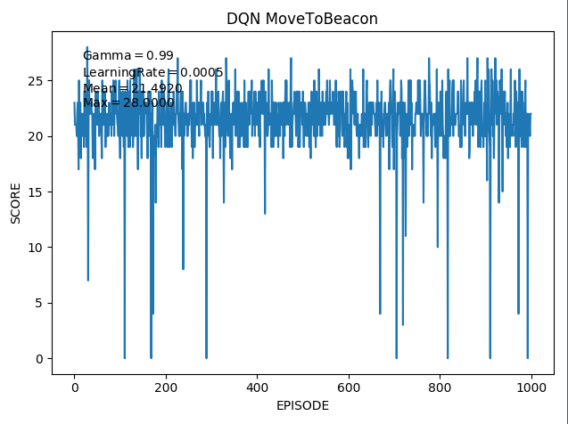

# RL_pysc2
Deep Reinforcement Learning algorithms for Starcraft II (Pytorch).\
Mini games: Move to Beacon and Collect Mineral Shards (You need to download these beforehand)

### DQN:

### A2C:

|     __ __TABLE        |  MoveToBeacon(DQN) |  MoveToBeacon(A2C) | Best Deepmind Scores|   
| :---:         |     :---:      |          :---: |           :---: |
|  MEAN   | 21.5     | 22.5    | 26
|  MAX     | 28       | 29      | 45

Thanks to [@chagmgang](https://github.com/chagmgang) for providing an initial baseline for our state and actions.(https://github.com/chagmgang/pysc2_rl)

And another thanks to [@MorvanZhou](https://github.com/MorvanZhou) for the DQN part. (https://github.com/MorvanZhou/PyTorch-Tutorial/blob/master/tutorial-contents-notebooks/405_DQN_Reinforcement_learning.ipynb)

We used [@Teslatic](https://github.com/Teslatic)'s code for calculating states and distances. As he stated in his repo: "We used  feature_screen.selected since marine vanishes behind beacon when using feature_screen.player_relative"

We mainly followed [StarCraft II: A New Challenge for Reinforcement Learning paper](https://deepmind.com/documents/110/sc2le.pdf)

## [@batuhan-ince](https://github.com/batuhan-ince) & [@EmircanKilickaya](https://github.com/EmircanKilickaya)

 
